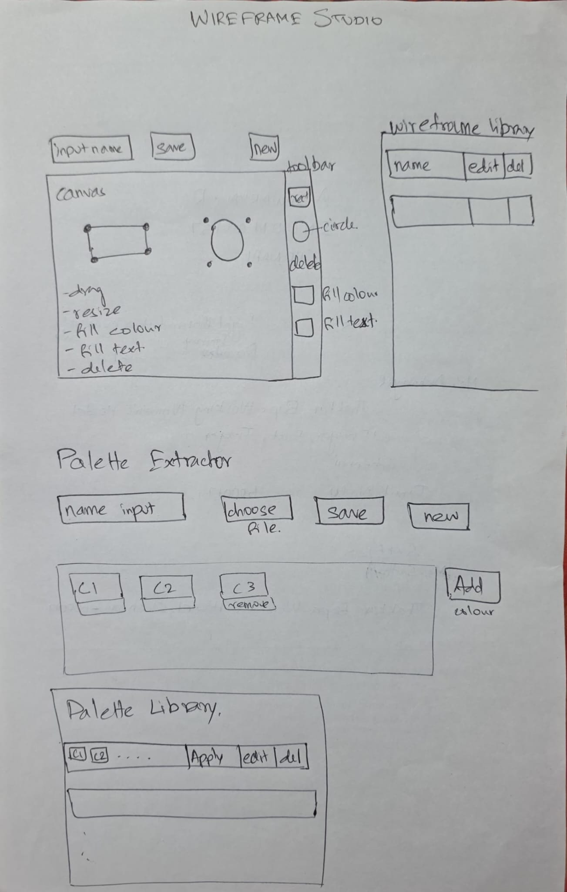
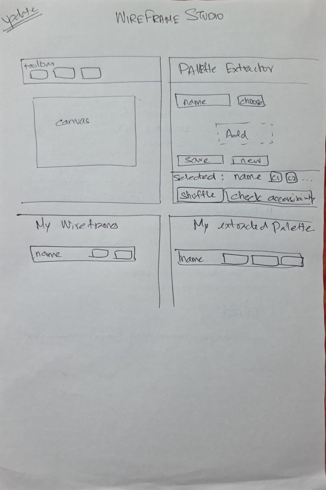
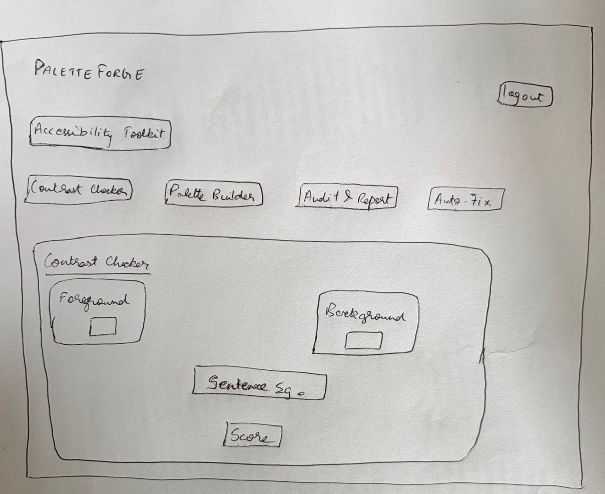
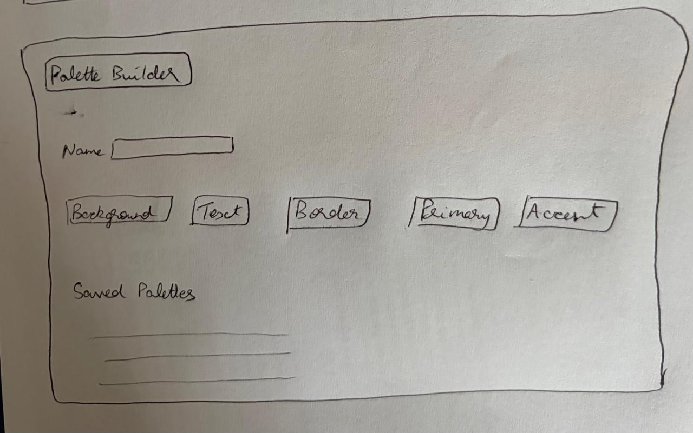
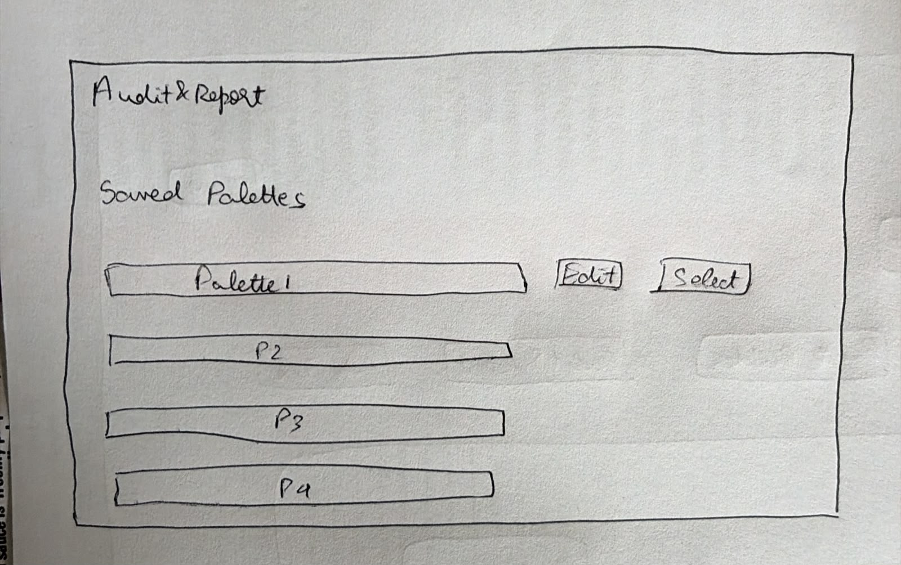
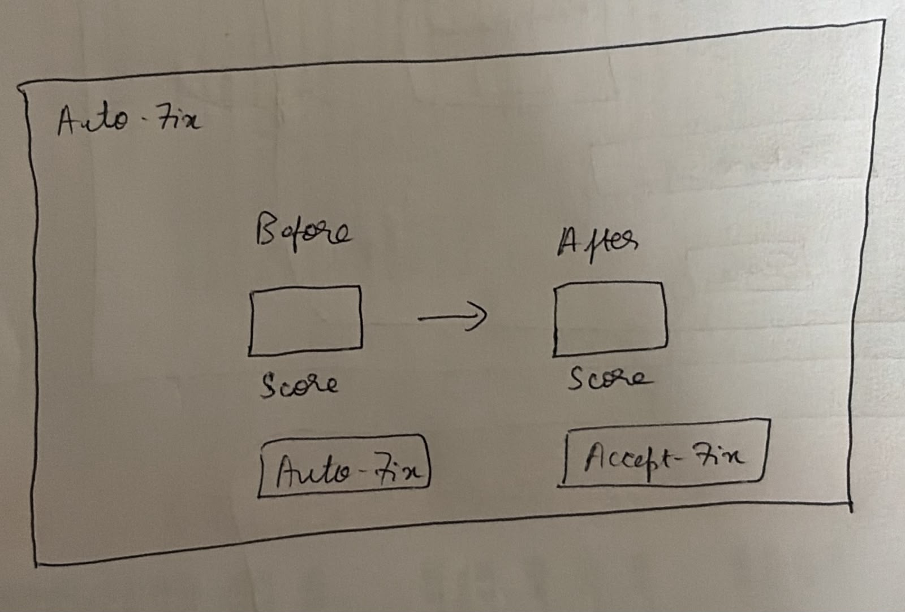

# Design Document — PaletteForge

---

## Project Description

PaletteForge is a full-stack design tool built as part of CS 5610 Web Development at Northeastern University, by Aishwarya Rajmohan and Priyan Baskar.

The idea came out of a problem from a previous project: wanting to try different color palettes on a mockup and visually judge what looked best, with no way to do that without reaching for an AI tool. PaletteForge solves exactly that. Users sketch a wireframe, upload any image, and the app extracts its dominant colors and applies or shuffles them onto the wireframe's shapes with just deterministic client-side color extraction (canvas pixel sampling and dominant-color ranking).

Alongside that, PaletteForge includes a full accessibility layer: build palettes manually by UI role, check WCAG contrast between any two colors, audit a whole palette for contrast issues across multiple role pairings, and auto-fix a failing color while preserving the designer's original hue. The goal is to make color exploration and accessible design both fast and painless, in one connected tool, instead of two disconnected ones.

PaletteForge uses four MongoDB collections:

1. **`wireframes`** — full CRUD: users create, view, edit, and delete saved wireframes.
2. **`extractedPalettes`** — full CRUD: users create, view, rename, and delete palettes extracted from uploaded images.
3. **`contrastPalettes`** — full CRUD: users build, view, edit, and delete manually-built accessibility palettes.
4. **`contrastReports`** — full CRUD: users generate, view, save, and delete accessibility audit reports.

**Tech stack:** React with Hooks, HTML5, CSS3, Node.js + Express, MongoDB (native driver, no Mongoose), Passport (local strategy) for authentication, Fetch API for data requests. Axios, Mongoose, and CORS are explicitly not used.

The project is split between two developers. Aishwarya Rajmohan built the Wireframe Studio and the image-based Palette Extractor. Priyan Baskar built the Contrast Checker, the role-based Palette Builder, and the accessibility audit/auto-fix tools, along with authentication.

---

## User Personas

### Persona 1 — Edna Mode, the Rapid Prototyper

**Role:** Designer moving fast through early-stage layout ideas
**Goal:** Sketch a layout and try color combinations quickly, without manually recoloring every element by hand

Edna doesn't want to commit to a color scheme by hand-picking hex codes one shape at a time. She wants to drop shapes onto a board, pull colors straight out of a reference image, and see multiple looks fast. She saves palettes she likes so she doesn't have to redo the extraction later, and she shuffles a palette across her shapes to compare arrangements without manually reassigning every color herself.

---

### Persona 2 — Miranda Priestly, the Accessibility-Conscious Designer

**Role:** Exacting designer who treats accessibility as non-negotiable
**Goal:** Know her colors are actually readable and WCAG-compliant, without manually calculating contrast ratios

Miranda doesn't accept "it looks fine to me" as a substitute for a real contrast ratio. She wants to compare any two colors instantly and see a pass/fail badge against AA and AAA thresholds, for both normal and large text. When she's building a palette from scratch, she wants to assign colors to specific UI roles — background, primary, accent, text, border — and get a full compliance report across every relevant pairing before she considers the palette finished.

---

### Persona 3 — Nigel, the Design Reviewer

**Role:** Gives the final verdict on whether a design passes muster
**Goal:** A quick way to audit a palette for accessibility problems and get a report to hand off to developers

Nigel reviews palettes other people built, not his own. He needs a one-click way to see which color pairings fail, and — critically — a way to fix a failing color without redesigning it from scratch. He wants the fix to nudge the color just enough to pass, preserving its hue, so the palette still looks like the same design intent after the fix as before it.

---

## User Stories

The following user stories were defined in the project proposal and guided the feature set of the app.

**Wireframe Studio & Palette Extraction (Aishwarya Rajmohan)**

- As Edna Mode, I want to add, select, move, resize, and recolor shapes on a wireframe board so I can quickly sketch layout ideas.
- As Edna Mode, I want to upload an image and have its dominant colors automatically extracted into a saveable palette so I don't have to pick colors manually.
- As Edna Mode, I want to apply a saved palette to a wireframe, mapped across my shapes, and shuffle the mapping so I can quickly compare different looks.

**Contrast Checker & Accessibility Audit (Priyan Baskar)**

- As Miranda Priestly, I want to compare any two colors and instantly see their WCAG contrast ratio and AA/AAA pass-fail status so I know if my choices are legible.
- As Miranda Priestly, I want to build my own palette by role and get a full audit report of every role-pair's contrast compliance so I can catch issues before finalizing a design.
- As Nigel, I want a one-click auto-fix that nudges failing colors just enough to pass WCAG thresholds while preserving the original hue so I can fix issues without redesigning from scratch.

---

## Division of Work

**Aishwarya Rajmohan — Wireframe Builder & Palette Extractor (Full-Stack)**

- Frontend: Wireframe board (shape placement, drag-to-move, resize, manual recoloring) and Palette Extractor (image upload, extracted palette display, apply-to-wireframe, shuffle)
- Backend & DB: Full CRUD for `wireframes` and `extractedPalettes`; client-side color extraction (canvas pixel sampling, dominant color ranking)

**Priyan Baskar — Contrast Checker & Accessibility Audit (Full-Stack)**

- Frontend: Contrast Checker (two-color comparison, ratio display), Palette Builder (manual palette by role), Audit & Report view (compliance breakdown), Auto-Fix
- Backend & DB: Full CRUD for `contrastPalettes` and `contrastReports`; WCAG contrast-ratio calculation and auto-fix nudging algorithm; authentication (Passport local strategy, sessions)

**Integration note:** A **"Check accessibility →"** button on the Wireframe Studio's applied-palette panel takes the palette currently applied to the wireframe and hands its colors to the Palette Builder, pre-filled by role — the only handoff between the two feature sets, with no shared database reads. This evolved slightly from the original proposal's "Send to Contrast Checker" — it lands on the Palette Builder instead, since that's where role-tagged colors are reviewable before checking any specific pair.

---

## Design Mockups

Wireframe Studio:
Design 1: Shape board, palette extraction, and library

Design 2: Moved them to be side by side:

Accessibility Toolkit — Contrast Checker:

Accessibility Toolkit — Palette Builder:

Accessibility Toolkit — Audit & Report:

Accessibility Toolkit — Auto-Fix before/after:

---

## Design Decisions

### Visual theme

A clean, light UI with a single purple/lavender accent (`#5B3A8F`-family) for primary actions and the active nav tab, against a white/light-gray background. The palette is intentionally minimal — the app's whole point is showing _user-chosen_ colors clearly, so the chrome around them stays neutral and doesn't compete for attention.

### No client-side router

PaletteForge is a single-page app with exactly one URL. Navigation between Wireframe Studio and the Accessibility Toolkit is a plain `useState` tab switch in `App.jsx`, not `react-router`. There are no distinct pages to deep-link to — adding a router would introduce indirection to solve a problem the app doesn't have.

### Component organization by feature vertical

`frontend/src/components` is split into `WireframeStudio/` and `AccessibilityToolkit/` folders, mirroring the two verticals in the proposal's Division of Work rather than a flat list or a type-based split (`components/`, `containers/`, etc.). Each developer's components live together; shared cross-cutting pieces like `AuthGate` stay at the top level.

### Distinct naming for the two "palette" features

Both verticals ended up with a palette-building feature — Wireframe Studio's image extraction and the Accessibility Toolkit's role-based builder. They're headed **"Extract Palette from Image"** and **"Palette Builder"** respectively, deliberately distinct, since they solve different problems (arbitrary colors pulled from a photo vs. deliberately assigned UI roles) and sit in different collections (`extractedPalettes` vs. `contrastPalettes`).

### Disabled state without opacity

Disabled color swatches use `box-shadow: inset 0 0 0 2px var(--color-bg)` rather than `opacity`, since `opacity` visibly distorts the true color value (a black swatch at 50% opacity renders as gray). The swatch always shows the real, undistorted color, whether it's clickable or not.

### Shuffle never repeats the previous combination

The Shuffle feature re-randomizes an applied palette across the wireframe's shapes, retrying (capped at 20 attempts) until the new arrangement differs from the one just shown — so clicking Shuffle with only two colors doesn't visibly do nothing some fraction of the time.

### Auto-fix preserves hue

The auto-fix algorithm converts the failing foreground color to HSL and searches only along the lightness axis for the smallest change that reaches the target contrast ratio, in both directions (darker and lighter), picking whichever needs less movement. Hue and saturation never change, so a fixed color still visibly belongs to the same palette.

### Session-based auth, no client-side user context

Login state lives in one top-level `AuthGate` component that wraps the whole app; there's no React Context for the logged-in user. Nothing else in the component tree currently needs to know who's logged in — `ownerId` scoping happens entirely server-side from the session cookie — so a Context would solve a prop-drilling problem that doesn't exist yet.

### No CORS package

The Vite dev server proxies `/api/*` requests to the Express backend, so the frontend and backend are always same-origin from the browser's perspective, in development and in production (Express serves the built frontend directly). This avoids needing a CORS package entirely, consistent with the project's prohibited-library constraints.

### Mobile responsiveness with an explicit caveat

The layout stacks vertically below the tablet breakpoint, but drag-to-move, resize handles, and native color pickers are all mouse-precision interactions that don't translate well to touch. Rather than pretend full parity, the app shows an explicit notice ("PaletteForge works best on a larger screen...") so mobile users aren't confused by degraded precision.
