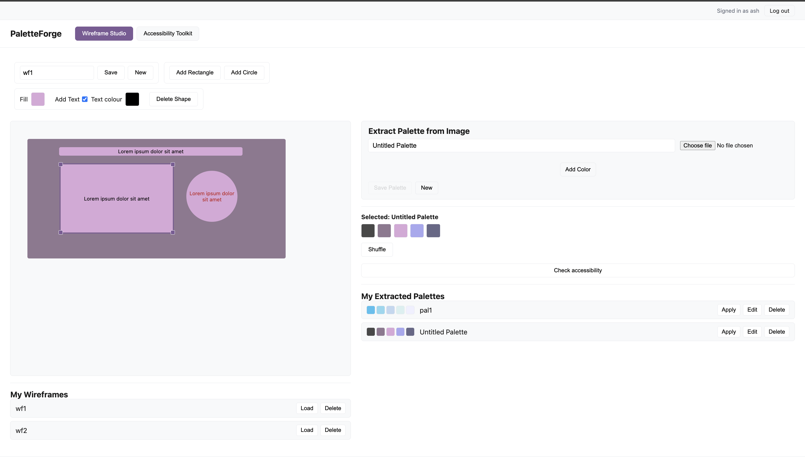
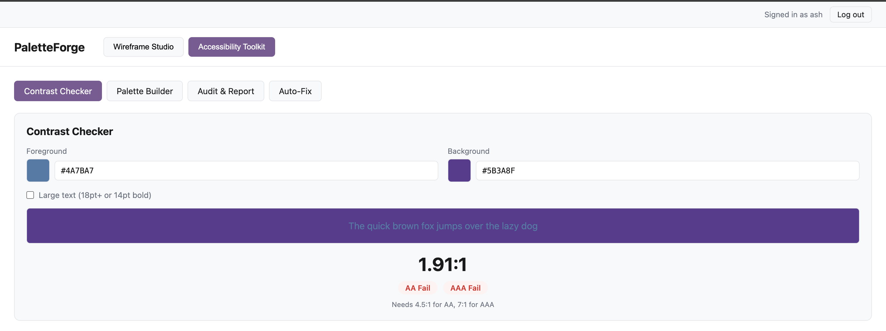
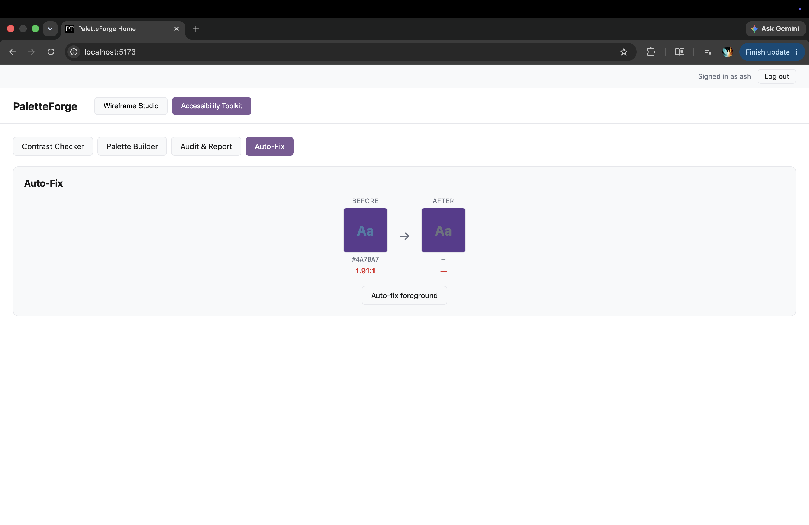
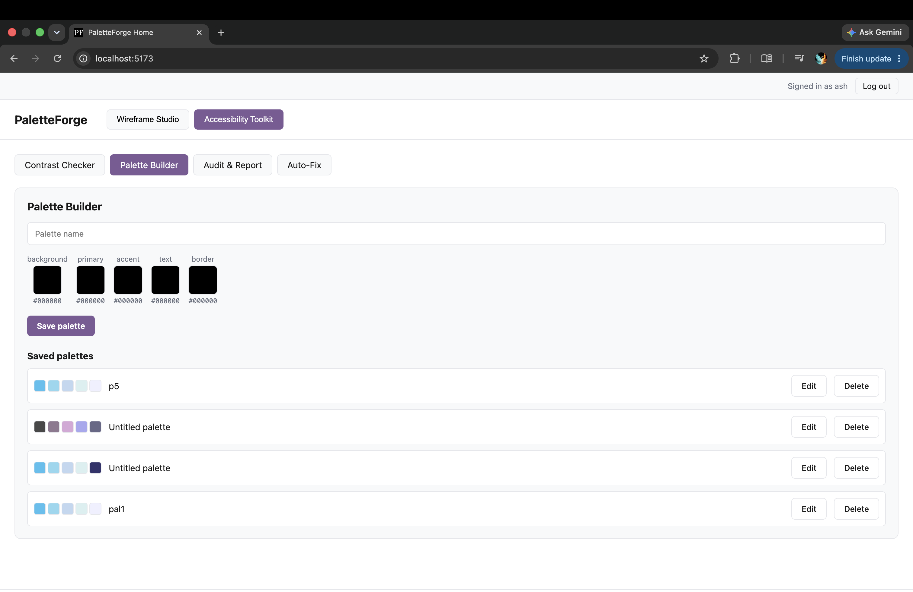
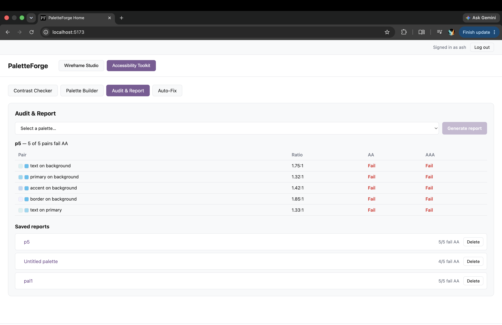

# PaletteForge

A full-stack design tool that pairs a wireframe board with an accessibility toolkit — sketch a layout, extract or build a color palette, apply it to your shapes, and check every color pairing against WCAG contrast standards before you commit to it.

---

## Authors

**Aishwarya Rajmohan** [LinkedIn](https://linkedin.com/in/aishwaryamohan1698) · [GitHub](https://github.com/aish6498-hub) — Wireframe Studio: shape board, drag/resize/recolor, personal wireframe + palette libraries, image-based palette extraction, apply/shuffle, and the Accessibility Toolkit handoff

**Priyan Baskar** [LinkedIn](https://www.linkedin.com/in/priyan-baskar-a1263227a/) · [GitHub](https://github.com/priyan-b) — Accessibility Toolkit: contrast checker, role-based palette builder, audit & report, auto-fix, and authentication (Passport local strategy, sessions)

---

## Class Link

[CS 5610 — Web Development](https://johnguerra.co/classes/webDevelopment_online_summer_2026/)

---

## Deployment

The app is deployed at:
[https://paletteforge.onrender.com](https://paletteforge.onrender.com)

---

## Project Objective

Most design tools separate "make it look right" from "make it accessible" — you build a mockup, then someone else runs an accessibility pass on it later, if at all. PaletteForge keeps both in the same place.

The **Wireframe Studio** side is a lightweight layout tool: drop rectangles and circles onto a board, drag and resize them, recolor them by hand, or pull a palette straight out of an uploaded image (via canvas-based color extraction — no external API). Palettes and wireframes both save to a personal library per account, and a Shuffle feature randomly reassigns an applied palette across your shapes without ever repeating the same combination twice in a row.

The **Accessibility Toolkit** side takes that same color thinking and checks it against WCAG 2.1 contrast math: a live contrast checker with pass/fail badges, a role-based palette builder (background/primary/accent/text/border), a batch audit that scores a saved palette across multiple foreground/background pairings, and an auto-fix tool that nudges a failing color's lightness just enough to pass — without changing its hue.

The bridge between the two: a **"Check accessibility"** button in Wireframe Studio takes whatever palette you've applied to your shapes and hands it straight to the Palette Builder, pre-filled, so you can audit it without re-entering a single hex code.

### Features

_Aishwarya Rajmohan — Wireframe Studio_

- **Shape board** — add rectangles/circles, drag to reposition, resize from any corner, select and delete
- **Manual recolor** — per-shape fill color picker, optional text label with its own color
- **Wireframe library** — save, load, and delete named wireframes tied to your account
- **Image palette extraction** — upload an image, get a color palette pulled from it via client-side canvas quantization (no external API)
- **Palette library** — save, edit, and delete extracted palettes independently of any wireframe
- **Apply + Shuffle** — apply a saved palette to your shapes; Shuffle randomly reassigns colors and is guaranteed not to repeat the previous combination
- **Manual color matching** — click a palette swatch to apply it directly to the currently selected shape
- **Accessibility handoff** — one click sends the applied palette's colors into the Accessibility Toolkit's Palette Builder, pre-filled by role

_Priyan Baskar — Accessibility Toolkit_

- **Authentication** — register/login/logout via Passport local strategy, bcrypt-hashed passwords, session cookies (`express-session`)
- **Contrast Checker** — live WCAG contrast ratio between any two colors, with AA/AAA pass-fail badges for normal and large text
- **Palette Builder** — assign colors to five fixed UI roles (background, primary, accent, text, border) and save named palettes
- **Audit & Report** — run a saved palette against a fixed set of role pairings and generate a saved contrast report
- **Auto-Fix** — automatically nudge a failing foreground color's lightness (in HSL space) until it passes its contrast target against a background, preserving hue

---

## Screenshot

Wireframe Studio — shape board with an applied palette:


Accessibility Toolkit — Contrast Checker:


Accessibility Toolkit — Auto-Fix before/after:


Accessibility Toolkit — Palette Builder:


Accessibility Toolkit — Audit & Report:


---

## Views

PaletteForge is a single-page app with no client-side router — navigation between the two tools is a plain `useState` tab switch, since there are no distinct URLs to deep-link to.

| View                  | Author    | Description                                                                                 |
| --------------------- | --------- | ------------------------------------------------------------------------------------------- |
| Wireframe Studio      | Aishwarya | Shape board, wireframe library, image palette extraction, palette library, apply/shuffle    |
| Accessibility Toolkit | Priyan    | Contrast Checker, Palette Builder, Audit & Report, Auto-Fix (sub-tabs within the same view) |

---

## Tech Stack

**Frontend**

- React 19 (Hooks, function components)
- Vite — build tool and dev server (proxies `/api` to the backend, no CORS package needed)
- Plain CSS per component, no framework
- `prop-types` for runtime prop validation

**Backend**

- Node.js + Express 5 — REST API server
- MongoDB via the official `mongodb` driver — **no Mongoose**
- Passport.js (local strategy) + `express-session` — authentication and session cookies
- `bcryptjs` — password hashing
- `dotenv` — environment variable management

**Tooling**

- ESLint + Prettier — linting and formatting
- `node --watch` — backend auto-restart in development

---

## Project Structure

```
/
  backend.js                          # Express entry point, session/passport setup, route mounting
  auth.js                             # Passport local strategy, user creation
  seed.js                             # Dev script: seeds 1000+ synthetic contrastPalettes records
  /db
    connection.js                     # MongoDB connection module (native driver)
  /middleware
    requireAuth.js                    # Gates /api routes behind an authenticated session
  /routes
    auth.js                           # register / login / logout / me
    wireframes.js                     # Wireframe CRUD                              [Aishwarya]
    extractedPalettes.js              # Extracted palette CRUD                      [Aishwarya]
    contrastPalettes.js                # Role-based palette CRUD                     [Priyan]
    contrastReports.js                 # Audit report CRUD                           [Priyan]
  /utils
    wcag.js                           # WCAG contrast math + auto-fix (server copy)  [Priyan]
    roles.js                          # ROLES / AUDIT_PAIRS constants
  /frontend
    /src
      App.jsx                         # Tab navigation between the two tools
      main.jsx                        # Root render, wraps App in AuthGate
      /components
        /AuthGate                     # Login/register form + session gate           [Priyan]
        /WireframeStudio                                                             [Aishwarya]
          WireframeStudio.jsx          # Owns all wireframe + palette editing state
          WireframeBoard.jsx           # Shape canvas (drag/resize/select)
          Shape.jsx                    # Individual shape rendering + drag/resize handles
          WireframeLibrary.jsx         # Saved wireframes list
          PaletteExtractor.jsx         # Image upload + color extraction UI
          PaletteLibrary.jsx           # Saved extracted palettes list
          PaletteApplyPanel.jsx        # Apply/shuffle/manual-match UI for the selected palette
        /AccessibilityToolkit                                                        [Priyan]
          AccessibilityToolkit.jsx     # Sub-tab navigation
          /ContrastChecker
          /PaletteBuilder
          /PaletteAudit
          /AutoFix
      /utils
        extractPalette.js              # Canvas-based color quantization              [Aishwarya]
        shuffleArray.js                 # Fisher-Yates shuffle with never-repeat retry [Aishwarya]
        wcag.js                        # WCAG contrast math (frontend copy)           [Priyan]
        roles.js                        # ROLES / AUDIT_PAIRS constants (frontend copy) [Priyan]
      /api
        wireframes.js, palettes.js, contrastApi.js   # fetch wrappers per feature
  package.json                        # Backend dependencies + scripts
  frontend/package.json                # Frontend dependencies + scripts
  .env.example
  .gitignore
  LICENSE
  README.md
```

---

## Instructions to Build

### Prerequisites

- [Node.js](https://nodejs.org/) v18 or higher
- npm (comes with Node.js)
- A MongoDB instance (local or [MongoDB Atlas](https://www.mongodb.com/cloud/atlas) free tier)

### 1. Clone the repo

```bash
git clone https://github.com/Priyan-B/PaletteForge.git
cd PaletteForge
```

### 2. Install dependencies

```bash
npm install
cd frontend && npm install && cd ..
```

### 3. Set up environment variables

Copy `.env.example` to `.env` and fill in your own values:

```bash
cp .env.example .env
```

```env
# MongoDB
MONGODB_URI=your_mongodb_connection_string_here

# Session
SESSION_SECRET=replace_with_a_long_random_string

# Server
PORT=3000
```

`SESSION_SECRET` is required — the server throws on startup if it's missing. You can generate one with:

```bash
node -e "console.log(require('crypto').randomBytes(32).toString('hex'))"
```

### 4. (Optional) Seed sample accessibility data

```bash
node seed.js
```

Populates `contrastPalettes` with 1000+ synthetic records for testing the Audit & Report feature at scale.

### 5. Run in development

In one terminal, start the backend:

```bash
npm run dev
```

In a second terminal, start the Vite dev server:

```bash
cd frontend
npm run dev
```

The frontend runs at [http://localhost:5173](http://localhost:5173) and proxies all `/api` requests to the backend at `http://localhost:3000` — no CORS package needed.

### 6. Production build

```bash
cd frontend && npm run build
cd ..
npm start
```

This builds the frontend into `frontend/dist` and serves it directly from the Express server at [http://localhost:3000](http://localhost:3000).

---

## GenAI Usage

AI tools were used as a collaborative aid throughout development — not to generate the app, but to accelerate decisions and debug tricky interactions. All code was reviewed and understood before use. Design decisions and creative direction were our own.

### Tools used

| Tool                    | Version  |
| ----------------------- | -------- |
| Claude Code (Anthropic) | Sonnet 5 |

### How it was used

- **Feature implementation** — wireframe board drag/resize logic, palette extraction algorithm, shuffle algorithm
- **Debugging** — diagnosed a shuffle bug that could repeat the previous color combination, a stale-palette-reference bug after editing/deleting the currently-applied palette, and a session-cookie misunderstanding during manual testing
- **Refactoring** — reorganized `frontend/src/components` from a flat structure into per-feature folders (`WireframeStudio/`, `AccessibilityToolkit/`) to match the app's two verticals
- **Security review** — flagged and fixed a weak default session secret

### Sample prompts used

```
"on shuffle colours, if there are only 2 colours, the same apply happens a few times before it shuffles. can we make it like it is never the previous combination this time and that it always updates?"

"previously, when selected palette gets edited, it was not reflecting when shuffling. is it working now?"

"I have switched to my partner's branch. verify the full codebase and validate if his code works and is correct."

"For integration testing, check if the palette applied in wireframe studio is being sent to accessibility toolkit correctly."

"both partner and i have palette builder now. is it a duplicate feature?"

"reorganize the frontend components folder into two subfolders based on the 2 verticals of the app."

"If I want to use passport for authentication in this project, what are the steps? Just give me step by step instruction as an md file in chat"

"sample read me. Create a read me in a similar way. "
```

---

## License

[MIT](./LICENSE)
