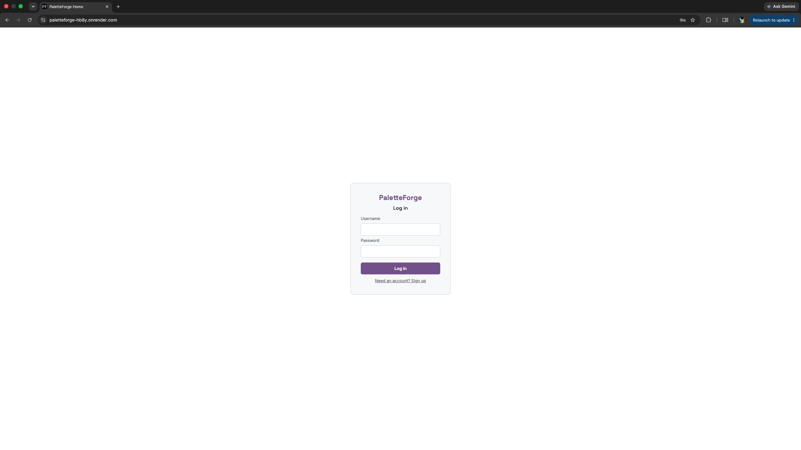
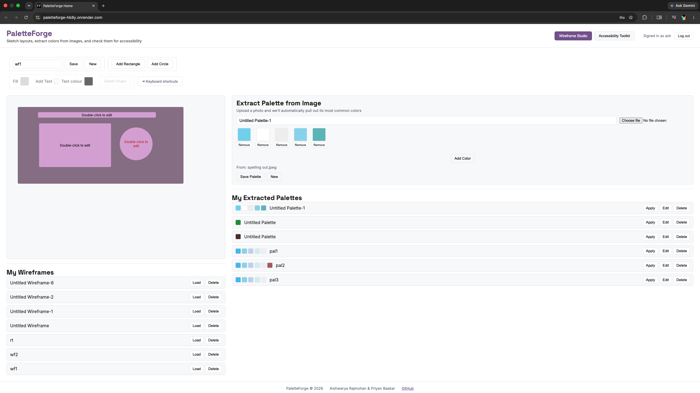
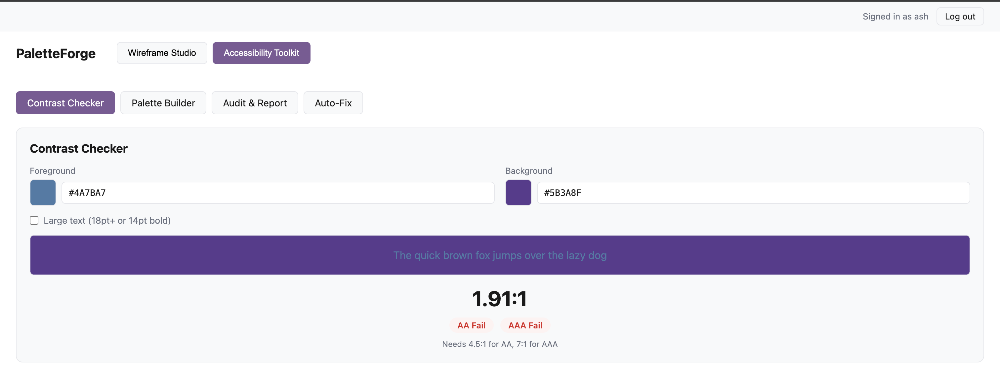
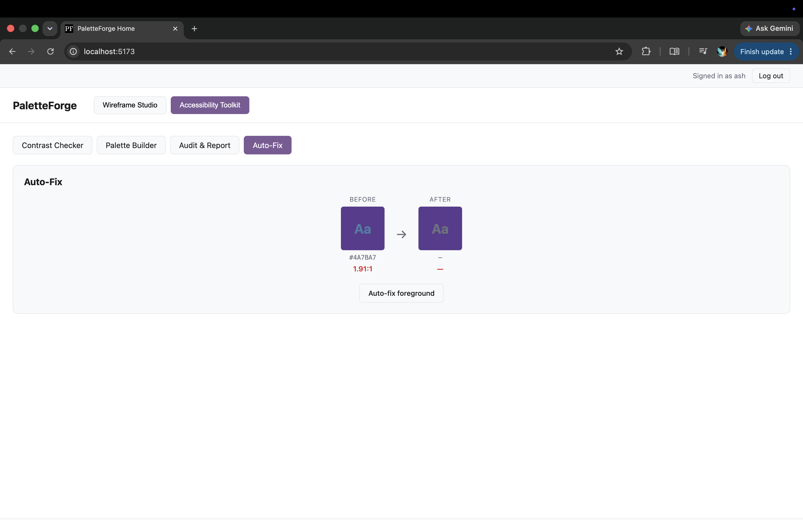
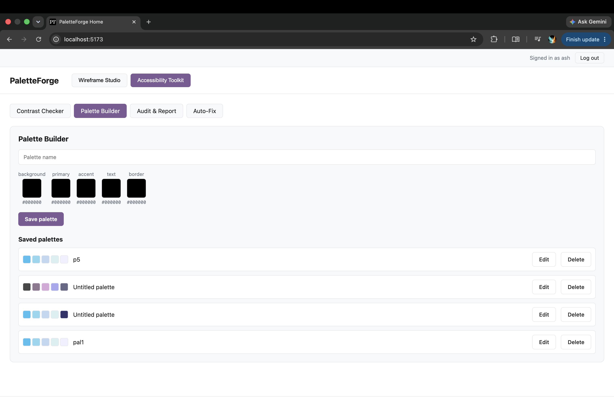
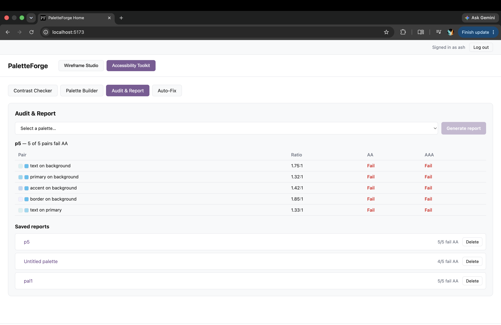

# PaletteForge

A full-stack design tool that pairs a wireframe board with an accessibility toolkit — sketch a layout, extract or build a color palette, apply it to your shapes, and check every color pairing against WCAG contrast standards before you commit to it.

---

## Authors

**Aishwarya Rajmohan** [LinkedIn](https://linkedin.com/in/aishwaryamohan1698) · [GitHub](https://github.com/aish6498-hub) — Wireframe Studio

**Priyan Baskar** [LinkedIn](https://www.linkedin.com/in/priyan-baskar-a1263227a/) · [GitHub](https://github.com/priyan-b) — Accessibility Toolkit

---

## Class Link

[CS 5610 — Web Development](https://johnguerra.co/classes/webDevelopment_online_summer_2026/)

---

## Deployment

The app is deployed at:
[https://paletteforge-hb8y.onrender.com](https://paletteforge-hb8y.onrender.com)

---

## Project Objective

Most design tools separate "make it look right" from "make it accessible" — you build a mockup, then someone else runs an accessibility pass on it later, if at all. PaletteForge keeps both in the same place.

The **Wireframe Studio** side is a lightweight layout tool: drop rectangles and circles onto a board, drag, resize, and recolor them, or pull a palette straight out of an uploaded image via client-side color extraction (no external API). Wireframes and palettes both save to a personal library per account.

The **Accessibility Toolkit** side checks that same color thinking against WCAG 2.1: a live contrast checker, a role-based palette builder, a batch audit across multiple color pairings, and an auto-fix tool that nudges a failing color into passing.

### Features

_Aishwarya Rajmohan — Wireframe Studio_

- **Shape board** — add rectangles/circles, drag, resize, and recolor with keyboard support
- **Image palette extraction** — pull a color palette from an uploaded image via client-side canvas quantization (no external API)
- **Wireframe and palette libraries** — save, load, edit, and delete, tied to your account
- **Apply, Shuffle, and manual matching** — apply a saved palette to your shapes, shuffle it (won't repeat the immediately previous assignment), or click a swatch to recolor one shape directly

_Priyan Baskar — Accessibility Toolkit_

- **Authentication** — register/login/logout via Passport local strategy, bcrypt-hashed passwords, session cookies (`express-session`)
- **Contrast Checker** — live WCAG contrast ratio between any two colors, with AA/AAA pass-fail badges for normal and large text
- **Palette Builder** — assign colors to five fixed UI roles (background, primary, accent, text, border) and save named palettes
- **Audit & Report** — run a saved palette against a fixed set of role pairings and generate a saved contrast report
- **Auto-Fix** — automatically nudge a failing foreground color's lightness (in HSL space) until it passes its contrast target against a background, preserving hue

---

## From Design to Accessibility

The **"Check accessibility"** button in Wireframe Studio is the bridge between the two halves: it takes whatever palette you've applied to your shapes and hands it straight to the Accessibility Toolkit's Palette Builder, pre-filled by role. You can move from visual exploration to accessibility validation without re-entering a single hex code.

---

## Screenshot

Login page:


Wireframe Studio — shape board with an applied palette:


Accessibility Toolkit — Contrast Checker:


Accessibility Toolkit — Auto-Fix before/after:


Accessibility Toolkit — Palette Builder:


Accessibility Toolkit — Audit & Report:


---

## Views

PaletteForge is a single-page app with no client-side router — navigation between the two tools is a plain `useState` tab switch, since there are no distinct URLs to deep-link to.

| View                  | Author    | Description                                                                                 |
| --------------------- | --------- | ------------------------------------------------------------------------------------------- |
| Wireframe Studio      | Aishwarya | Shape board, wireframe library, image palette extraction, palette library, apply/shuffle    |
| Accessibility Toolkit | Priyan    | Contrast Checker, Palette Builder, Audit & Report, Auto-Fix (sub-tabs within the same view) |

---

## How to Use

**Wireframe Studio**

1. Sign up or log in.
2. Add and manipulate shapes on the board (drag, resize, recolor).
3. Create a palette manually or extract one from an uploaded image.
4. Apply the palette to your shapes, or shuffle the assignments.
5. Save the wireframe and palette to your library.
6. Select "Check accessibility" to send the palette to the Accessibility Toolkit.

**Accessibility Toolkit**

1. Use the Contrast Checker to test any two colors against WCAG AA/AAA thresholds.
2. Build a named palette by assigning colors to five UI roles (background, primary, accent, text, border) in Palette Builder.
3. Run Audit & Report on a saved palette to check every role pairing at once and save the report.
4. Use Auto-Fix to automatically adjust a failing color's lightness until it passes — without changing its hue.

---

## Accessibility

**Keyboard support — Wireframe Studio shape board:**

| Key                                           | Action                                                          |
| --------------------------------------------- | --------------------------------------------------------------- |
| `Tab`                                         | Move focus to the next shape (also selects it)                  |
| `↑` `↓` `←` `→`                               | Move the focused shape                                          |
| `Shift` + `↑` `↓` `←` `→`                     | Resize the focused shape (Up/Down = height, Left/Right = width) |
| `Escape`                                      | Deselect the focused shape                                      |
| `Tab` to "Delete Shape", then `Enter`/`Space` | Delete the focused shape                                        |

Adding shapes ("Add Rectangle" / "Add Circle") and every other control in the toolbar are standard `<button>`/`<input>` elements, so they're keyboard-operable by default — no mouse is required anywhere in the wireframe workflow.

**Other accessibility work:**

- Each shape has a descriptive `aria-label` (e.g., "Rectangle shape. Use arrow keys to move, Shift with arrow keys to resize.") for screen reader users.
- Focus is always visibly indicated: a solid outline on the selected shape, and a distinct dashed outline on the scrollable board region itself (so keyboard users can tell the two apart).
- Colors carry consistent meaning across the app — e.g., the save-confirmation toast reuses the same green already used for "AA Pass" badges in the Contrast Checker, rather than introducing an unrelated color for "success."

An in-app "Keyboard shortcuts" reference is available next to the wireframe toolbar (click to expand) — the same reference as the table above, without cluttering the UI by default.

**Accessibility across devices:**

PaletteForge is a single responsive codebase, so the same accessibility support applies whether it's opened on a desktop browser, a tablet, or a phone — there's no separate "mobile version" with different guarantees.

- Every input, button, checkbox, and color picker has an accessible name, via a visible label or `aria-label` — verified with automated accessibility testing (axe-core), which checks the same accessible-name/role semantics screen readers like VoiceOver and TalkBack rely on.
- Headings follow one correct hierarchy (`h1 → h2 → h3`) throughout both views, so screen reader users can jump by heading level on any screen size.
- All page content lives inside a semantic landmark (`<nav>`, `<main>`, `<footer>`) — including account info and the small-screen notice — so landmark-based navigation works everywhere.
- The layout reflows instead of requiring horizontal scrolling at narrow widths, and pinch-to-zoom is never disabled, so low-vision users can zoom in on any device.
- Touch targets meet the WCAG 2.5.8 minimum size (24×24px), and motion respects the OS-level `prefers-reduced-motion` setting — animations like the save-confirmation toast are skipped for users who've turned that on.
- Verified with an automated [axe-core](https://github.com/dequelabs/axe-core) audit at both desktop and mobile (375px) viewport widths: zero violations.

---

## Tech Stack

**Frontend**

- React 19 (Hooks, function components)
- Vite — build tool and dev server (proxies `/api` to the backend, no CORS package needed)
- Plain CSS per component, no framework
- `prop-types` for runtime prop validation

**Backend**

- Node.js + Express 5 — REST API server
- MongoDB via the official `mongodb` driver — **no Mongoose**
- Passport.js (local strategy) + `express-session` — authentication and session cookies
- `bcryptjs` — password hashing
- `dotenv` — environment variable management

**Tooling**

- ESLint + Prettier — linting and formatting
- `node --watch` — backend auto-restart in development

---

## Project Structure

```
/
  backend.js                          # Express entry point, session/passport setup, route mounting
  auth.js                             # Passport local strategy, user creation
  seed.js                             # Dev script: seeds 1000+ synthetic contrastPalettes records
  /db
    connection.js                     # MongoDB connection module (native driver)
  /middleware
    requireAuth.js                    # Gates /api routes behind an authenticated session
  /routes
    auth.js                           # register / login / logout / me
    wireframes.js                     # Wireframe CRUD                              [Aishwarya]
    extractedPalettes.js              # Extracted palette CRUD                      [Aishwarya]
    contrastPalettes.js                # Role-based palette CRUD                     [Priyan]
    contrastReports.js                 # Audit report CRUD                           [Priyan]
  /utils
    wcag.js                           # WCAG contrast math + auto-fix (server copy)  [Priyan]
    roles.js                          # ROLES / AUDIT_PAIRS constants
  /frontend
    /src
      App.jsx                         # Tab navigation between the two tools
      main.jsx                        # Root render, wraps App in AuthGate
      /components
        /AuthGate                     # Login/register form + session gate           [Priyan]
        /WireframeStudio                                                             [Aishwarya]
          WireframeStudio.jsx          # Owns all wireframe + palette editing state
          WireframeBoard.jsx           # Shape canvas (drag/resize/select)
          Shape.jsx                    # Individual shape rendering + drag/resize handles
          WireframeLibrary.jsx         # Saved wireframes list
          PaletteExtractor.jsx         # Image upload + color extraction UI
          PaletteLibrary.jsx           # Saved extracted palettes list
          PaletteApplyPanel.jsx        # Apply/shuffle/manual-match UI for the selected palette
        /AccessibilityToolkit                                                        [Priyan]
          AccessibilityToolkit.jsx     # Sub-tab navigation
          /ContrastChecker
          /PaletteBuilder
          /PaletteAudit
          /AutoFix
      /utils
        extractPalette.js              # Canvas-based color quantization              [Aishwarya]
        shuffleArray.js                 # Fisher-Yates shuffle with never-repeat retry [Aishwarya]
        wcag.js                        # WCAG contrast math (frontend copy)           [Priyan]
        roles.js                        # ROLES / AUDIT_PAIRS constants (frontend copy) [Priyan]
      /api
        wireframes.js, palettes.js, contrastApi.js   # fetch wrappers per feature
  package.json                        # Backend dependencies + scripts
  frontend/package.json                # Frontend dependencies + scripts
  .env.example
  .gitignore
  LICENSE
  README.md
```

---

## Instructions to Build

### Prerequisites

- [Node.js](https://nodejs.org/) v18 or higher
- npm (comes with Node.js)
- A MongoDB instance (local or [MongoDB Atlas](https://www.mongodb.com/cloud/atlas) free tier)

### 1. Clone the repo

```bash
git clone https://github.com/Priyan-B/PaletteForge.git
cd PaletteForge
```

### 2. Install dependencies

```bash
npm install
cd frontend && npm install && cd ..
```

### 3. Set up environment variables

Copy `.env.example` to `.env` and fill in your own values:

```bash
cp .env.example .env
```

```env
# MongoDB
MONGODB_URI=your_mongodb_connection_string_here

# Session
SESSION_SECRET=replace_with_a_long_random_string

# Server
PORT=3000
```

`SESSION_SECRET` is required — the server throws on startup if it's missing. You can generate one with:

```bash
node -e "console.log(require('crypto').randomBytes(32).toString('hex'))"
```

### 4. (Optional) Seed sample accessibility data

```bash
node seed.js
```

Populates `contrastPalettes` with 1000+ synthetic records for testing the Audit & Report feature at scale.

### 5. Run in development

In one terminal, start the backend:

```bash
npm run dev
```

In a second terminal, start the Vite dev server:

```bash
cd frontend
npm run dev
```

The frontend runs at [http://localhost:5173](http://localhost:5173) and proxies all `/api` requests to the backend at `http://localhost:3000` — no CORS package needed.

### 6. Production build

```bash
cd frontend && npm run build
cd ..
npm start
```

This builds the frontend into `frontend/dist` and serves it directly from the Express server at [http://localhost:3000](http://localhost:3000).

---

## GenAI Usage

AI tools were used as a collaborative aid throughout development — not to generate the app, but to accelerate decisions and debug tricky interactions. All code was reviewed and understood before use. Design decisions and creative direction were our own.

### Tools used

| Tool                    | Version  |
| ----------------------- | -------- |
| Claude Code (Anthropic) | Sonnet 5 |

### How it was used

- **Feature implementation** — wireframe board drag/resize logic, palette extraction algorithm, shuffle algorithm
- **Debugging** — diagnosed a shuffle bug that could repeat the previous color combination, a stale-palette-reference bug after editing/deleting the currently-applied palette, and a session-cookie misunderstanding during manual testing
- **Refactoring** — reorganized `frontend/src/components` from a flat structure into per-feature folders (`WireframeStudio/`, `AccessibilityToolkit/`) to match the app's two verticals
- **Security review** — flagged and fixed a weak default session secret

### Sample prompts used

```
"on shuffle colours, if there are only 2 colours, the same apply happens a few times before it shuffles. can we make it like it is never the previous combination this time and that it always updates?"

"previously, when selected palette gets edited, it was not reflecting when shuffling. is it working now?"

"I have switched to my partner's branch. verify the full codebase and validate if his code works and is correct."

"For integration testing, check if the palette applied in wireframe studio is being sent to accessibility toolkit correctly."

"both partner and i have palette builder now. is it a duplicate feature?"

"reorganize the frontend components folder into two subfolders based on the 2 verticals of the app."

"If I want to use passport for authentication in this project, what are the steps? Just give me step by step instruction as an md file in chat"

"sample read me. Create a read me in a similar way. "
```

---

## License

[MIT](./LICENSE)
